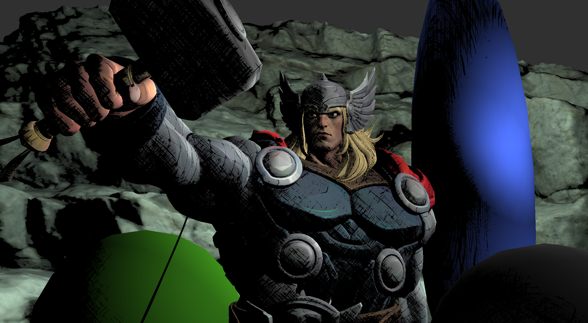
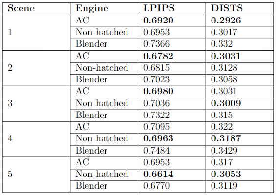

  <h1>AnitoCrossHatch: A 3D Editor Tool for Cross Hatch Rendered 3D Environments</h1>

 

  A Thesis Presented to 
  the Faculty of the College of Computer Studies 
  De La Salle University Manila  

  by 
  <strong>
    DE VERA, Jonathan L. 
    DONATO, Adriel Joseph Y. 
    MANIPOL, Marion Jose S. 
    REYES, Kenwin Hans D.
  </strong>

 

  

 
 
## Gallery

**[Paper](https://github.com/Zerithe/CrossHatchEditor)** \| **[Source](https://github.com/Zerithe/CrossHatchEditor)**

  
  
  
  
  
  

<!-- Lightbox popups -->

 
**[Explore More Images](./more-gallery.md)**

 

## Watch Our Trailer!

  <iframe src="https://www.youtube.com/embed/tr6x6hXhuC4"
          frameborder="0"
          allow="accelerometer; autoplay; clipboard-write; encrypted-media; gyroscope; picture-in-picture"
          allowfullscreen
          style="position: absolute; top: 0; left: 0; width: 100%; height: 100%;">
  </iframe>

 
 

<h2>Abstract</h2>

  This project, <strong>AnitoCrosshatch</strong>, is a 3D editing tool that digitally emulates traditional cross-hatching to bridge the gap between hand-drawn artistry and modern animation workflows. As the industry increasingly adopts stylized 2D elements—such as brush textures and vintage comic patterns—to distinguish 3D works, crosshatching remains underrepresented despite its proven ability to convey depth and materiality efficiently. Our editor integrates a three-pass BGFX pipeline that keeps the organic irregularity of manual crosshatching while offering artists precise control over line density, angle, and curvature. Across six benchmark scenes (up to 12 M triangles), the tool sustained the monitor-capped 144 FPS and used dramatically less memory than Unity and Blender, showing steadier frame times in the heaviest “Powerplant” model test.Quantitative image-similarity tests recorded the best DISTS = 0.2926 and LPIPS = 0.6980 against a 50-panel comic reference set, outperforming Blender’s stylised output in key scenes, while a 15-participant study yielded a mean System Usability Scale of 68.8—comfortably above the “acceptable” threshold and well ahead of Blender’s 51.5. Participants rated stylistic authenticity at 3.25 / 5, signalling recognisable but improvable fidelity to printed comics. Remaining limitations include a small, convenience-sampled evaluation dataset and missing quality-of-life features such as shortcut schemes and UI/UX improvements. Nevertheless, AnitoCrosshatch demonstrates the viability of specialized stylization tools and shows that a specialised editor can run at game-engine speeds without heavy resource cost. This opens up avenues for future development in real-time stylization rendering, suggesting a growing niche for traditionally inspired digital techniques in professional rendering pipelines.

 
---

## Performance Benchmark

We performed qualitative testing by conducting a comparative analysis of our framework against Blender and Unity to evaluate the technical capabilities of AnitoCrosshatch relative to standard 3D engine software. Benchmarking was conducted using standard 3D scenes, with evaluation criteria focused on frames per second (FPS) and memory usage. These scenes were selected from McGuire's (2017) archive, a well-established dataset used in prior rendering studies. Scene selection was based on object count and geometric complexity.

Scenes such as “Crytek Sponza”, “Conference Room”, “Rungholt”, and “Powerplant” feature numerous objects, while “Bedroom” and “Gallery” contain intricate geometry based on real-world scanned environments.

#### **Figure 1.0** – Standard 3D Scenes Rendered in AnitoCrosshatch  
  
*From left to right: Crytek Sponza ©2010 Frank Meinl, Crytek; Conference Room ©Anat Grnyberg and Greg Ward; Powerplant ©1999 University of North Carolina; Rungholt ©Kescha; Gallery ©2017 The Hallwyl Museum; Bedroom ©fhernand.*

#### **Figure 1.1** – Triangle Count of Each Scene  
  
*Geometry triangle count for the selected standard 3D scenes.*

#### **Figure 1.2** – Test Device Specifications  
  
*Computer specifications used for the performance tests.*

Different rendering pipelines were used for Blender and Unity to match the capabilities of our real-time rendering pipeline. Blender utilized the EEVEE engine with rendered viewport shading, while Unity used the Universal Rendering Pipeline (URP), suitable for real-time applications in both games and animations.

#### **Figure 1.3** – Rendering Pipelines for Each Engine  
  
*Rendering pipeline setup for AnitoCrosshatch, Blender, and Unity.*

To measure performance, we captured FPS over 1,000 frames with a cap at 144 FPS due to vertical synchronization (VSync). The FPS and memory usage were measured using platform-specific methods:
- **AnitoCrosshatch:** Built-in benchmarking functionality
- **Blender:** Python script for FPS and memory
- **Unity:** C# runtime script and built-in profiler

#### **Figure 1.4** – Expected FPS Measurements  
  
*Targeted FPS performance expectations for each engine.*

Figure 1.5 summarizes the comparative technical performance. AnitoCrosshatch demonstrated stable and efficient rendering with consistent FPS and lower memory usage. Blender showed variable FPS, with averages as low as 88.23 and minimums dropping to 13.32 FPS. Unity maintained stable FPS but consumed significantly more memory due to its larger engine overhead.

#### **Figure 1.5** – FPS and Memory Usage Results  
  
*FPS and memory usage over 1,000 frames. AnitoCrosshatch is abbreviated as AC.*

#### **Figure 1.6** – Technical Line Graph for Powerplant Scene  
  
*FPS measured over 100 frames for the Powerplant scene with 12M+ triangles.*

AnitoCrosshatch emerged as the most balanced engine, offering consistent real-time performance and minimal memory consumption, confirming its potential as a lightweight alternative for stylized rendering.

 
---

## Image Quality and Similarity

### Perceptual-Based Metrics

We conducted a quantitative evaluation of images rendered by AnitoCrosshatch and Blender using perceptual-based metrics, given that comparisons were made against a reference dataset rather than 1:1 ground-truth images.

We used the following metrics:
- **LPIPS** (Learned Perceptual Image Patch Similarity) – Zhang et al., 2018
- **DISTS** (Deep Image Structure and Texture Similarity) – Ding et al., 2020

Each rendered image Ri was compared to all reference dataset images Dj using the above metrics. We then averaged the similarity scores to assess how close the rendered output was to comic-style illustrations.

The dataset used for comparison included 50 scanned comic pages and panels featuring crosshatching. Which follows the methodology of Vivoli et al. (2023), in which all images were left untreated to preserve original artistic qualities. Before evaluation:
- White areas (speech bubbles, gutters) were masked.
- The same mask was applied to both rendered and reference images.
- A **Canny Edge Detection** step was added to focus on line-based crosshatching characteristics (Agrawal & Desai, 2024).

#### **Figure 2.0** – Samples from the Crosshatching Reference Dataset  
  
*Examples of raw, unaltered comic pages with crosshatching used in evaluation.*

#### **Figure 2.1** – Perceptual Metrics Results (LPIPS + DISTS)  
  
*Cross-hatched image results using LPIPS (masked + canny) and DISTS (masked + canny). Best values are bolded. AC = AnitoCrosshatch.*

#### **Figure 2.3** – Tested Rendered Images  
  
*Rendered outputs compared across metrics. A = AnitoCrosshatch, B = Blender, C = Baseline (non-crosshatched).*

Results (Figure 2.1) show that AnitoCrosshatch (AC) consistently performed better in **DISTS**, indicating higher structural similarity with comic panels. LPIPS results were more mixed, with AC typically outperforming Blender, though in some cases baseline images performed comparably.

These results affirm the stylistic relevance of AnitoCrosshatch’s outputs while highlighting areas for refinement. The relatively high LPIPS scores suggest that perceptual realism is still lacking in some aspects. Enhancements to the pipeline could further bridge the perceptual gap between stylized renderings and authentic comic panels.

### Human Perceptual Evaluation

To complement our quantitative image similarity metrics, we conducted a human perceptual evaluation to assess how well **AnitoCrosshatch**’s cross-hatching output resembles actual comic book panels. This evaluation aimed to capture subjective quality judgments that automated metrics might miss, particularly regarding the artistic authenticity of the cross-hatching technique.

#### **Figure 3.0** – Reference and Rendered Image Pairs for Evaluation  
  
*Top: Reference comic book panel images. Bottom: Rendered images from AnitoCrosshatch.*

Each participant evaluated all 5 test images, providing ratings based on their perception of how closely the rendered cross-hatching matched the style and quality found in professional comic book panels.

#### **Figure 3.1** – Human Perceptual Evaluation Table  
  
*Tabulated results of the perceptual evaluation for AnitoCrosshatch (n = 9 participants).*

#### **Figure 3.2** – Human Perceptual Evaluation Graph  
  
*Graphical overview of human ratings on cross-hatching quality generated by AnitoCrosshatch.*

The survey results reinforce our quantitative findings that AnitoCrosshatch produces cross-hatching of **moderate quality** compared to professional comic art. This suggests that while the system successfully generates the basic visual elements of cross-hatching, further refinements to the rendering algorithm may be needed to achieve higher artistic fidelity.

Future improvements could focus on enhancing the **naturalness and variability** of the cross-hatching patterns to better match the organic quality found in hand-drawn comic illustrations.

 
---

## Acknowledgements

We would like to acknowledge **De La Salle University Manila (DLSU)**, the **College of Computer Studies (CCS)**, the **DLSU GameLab** and the support of the **Department of Science and Technology – Philippine Council for Industry, Energy and Emerging Technology Research and Development (DOST-PCIEERD)** throughout the course of this project.

We also extend our deepest gratitude to our adviser, **Neil Patrick A. DEL GALLEGO, Ph.D.**, for his invaluable mentorship and expertise.

 
---
