# More Gallery Images

  
  <a href="#extra2">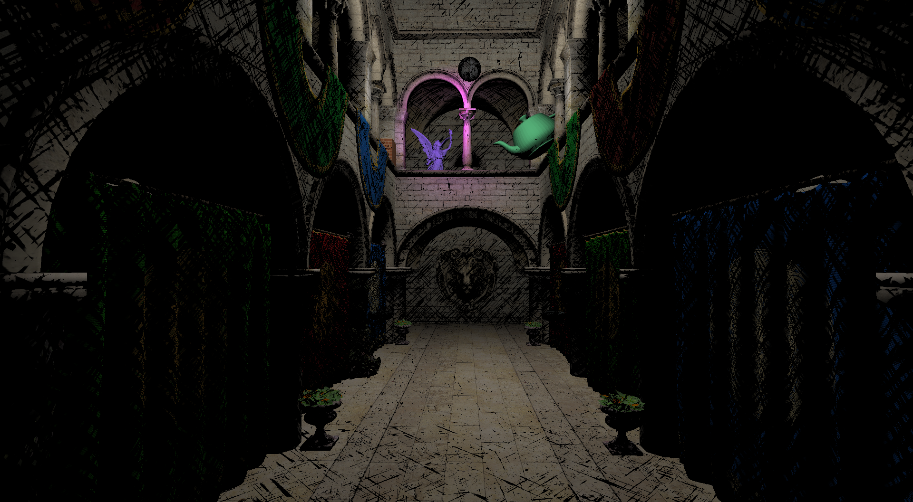</a>
  <a href="#extra3">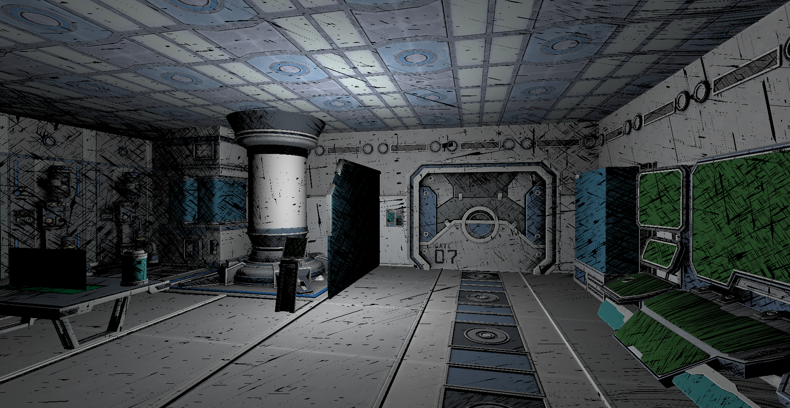</a>
  
  <a href="#extra5">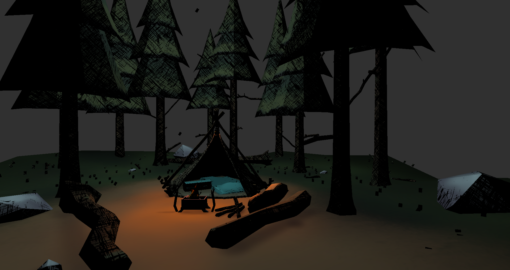</a>
  <a href="#extra6">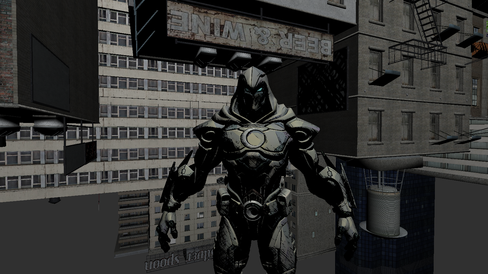</a>
  <a href="#extra7">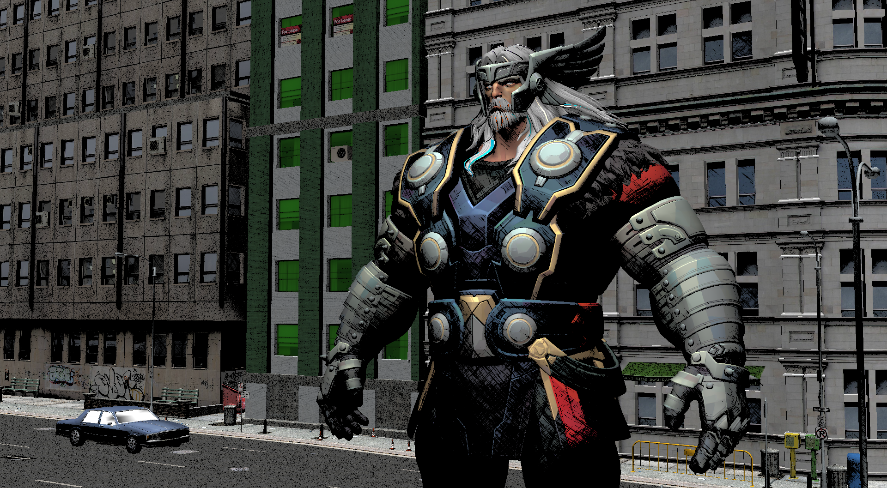</a>
  <a href="#extra8">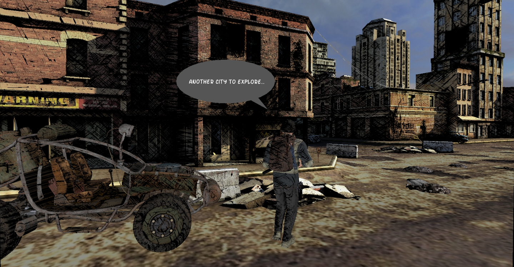</a>
  <a href="#extra9">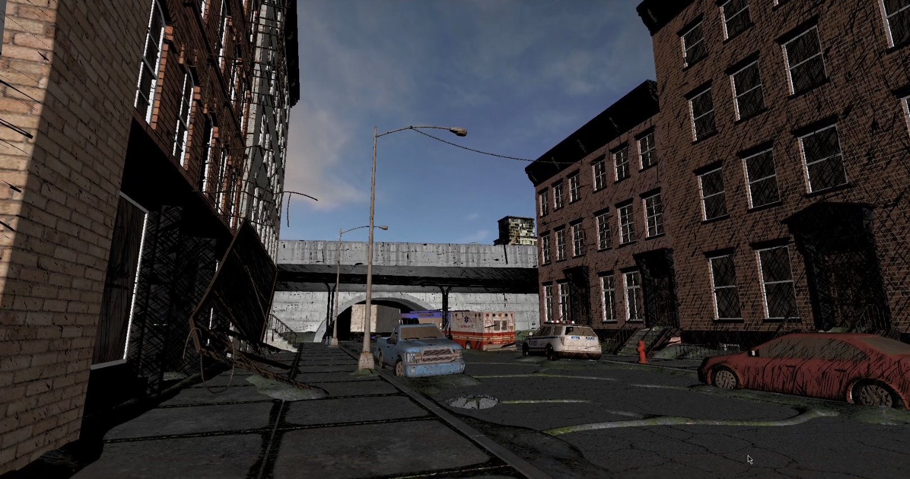</a>
  <a href="#extra10">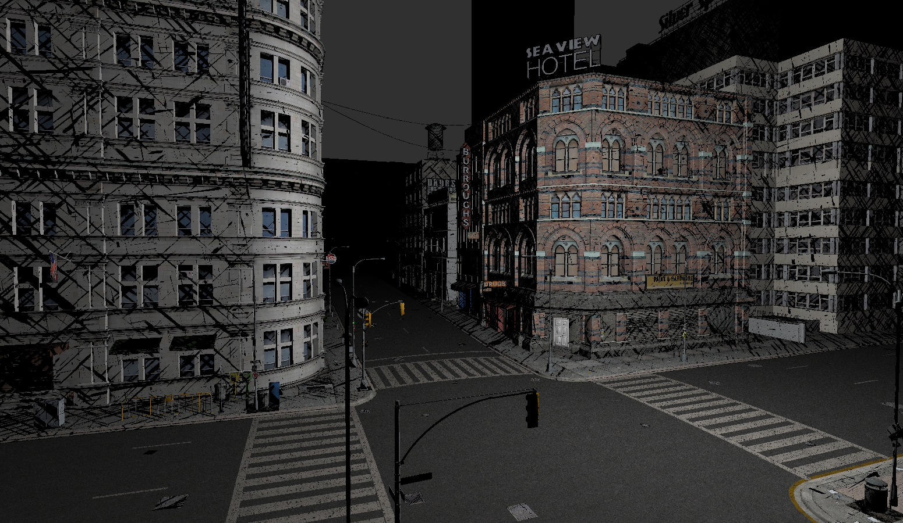</a>
  <a href="#extra11">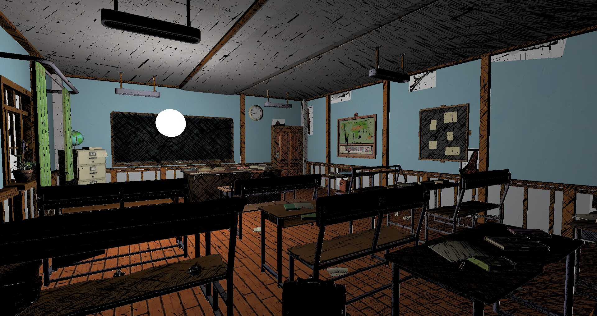</a>
  <a href="#extra12">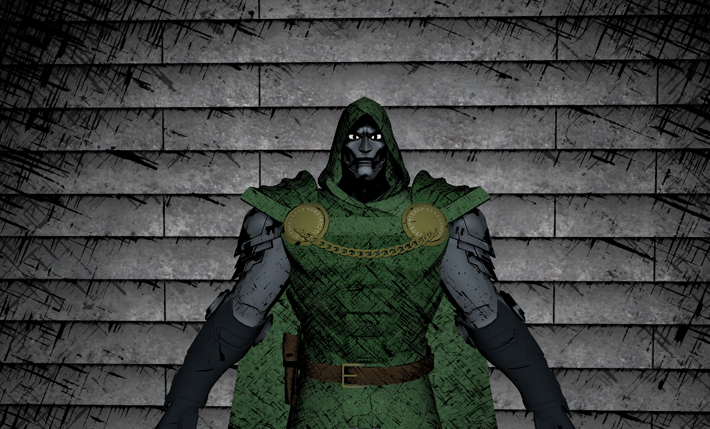</a>
  <a href="#extra13">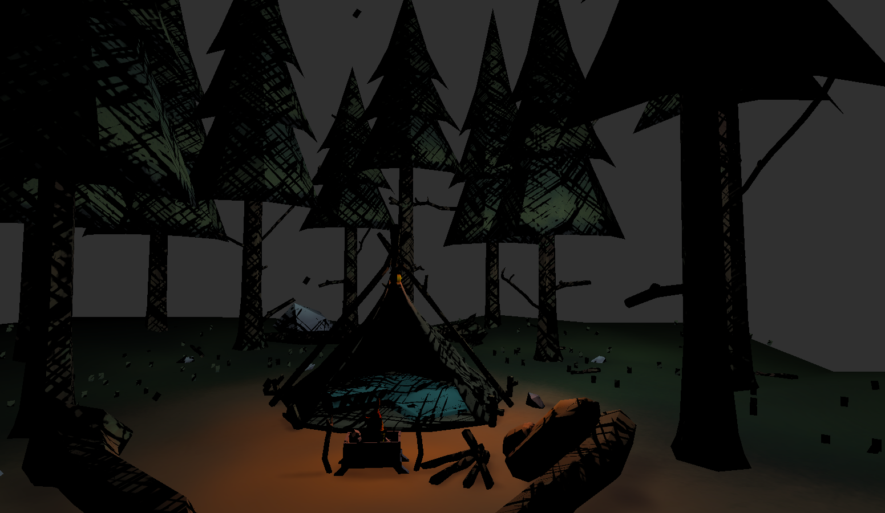</a>
  <a href="#extra14">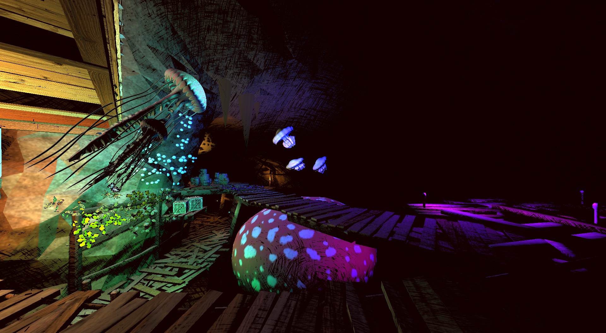</a>

<!-- Lightbox popups -->

 

**[Return to Home](./index.md)**
